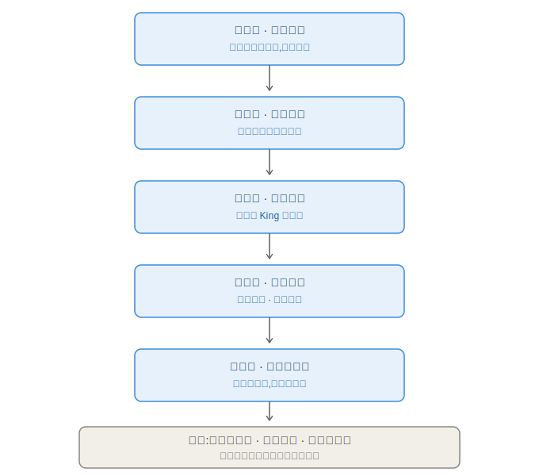
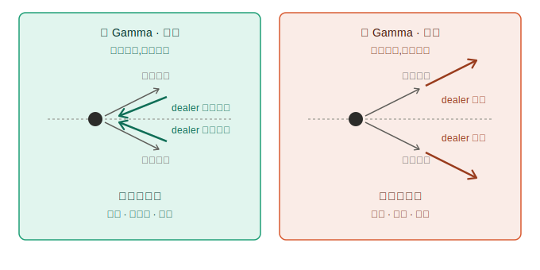
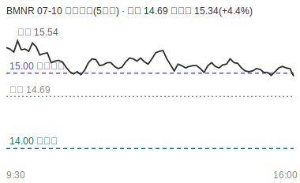
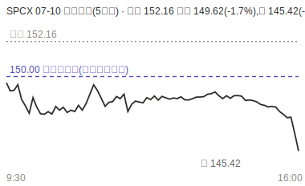
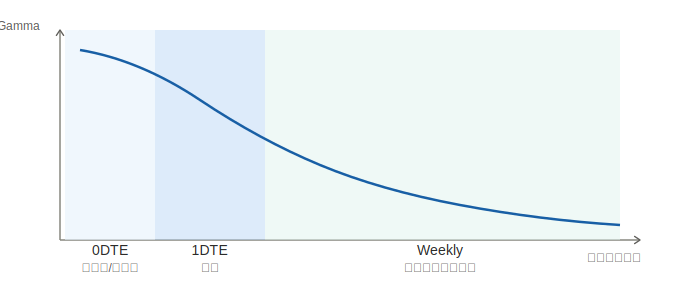
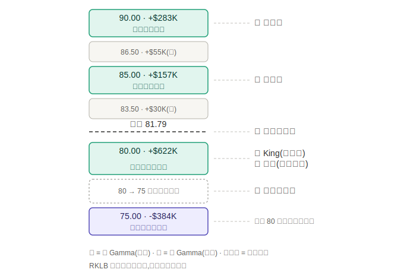
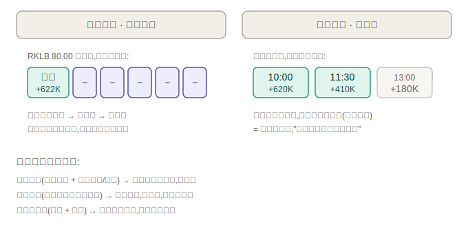
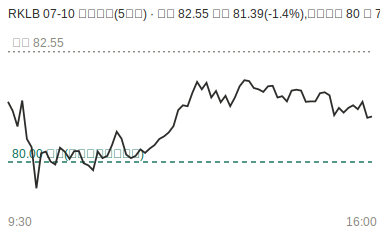
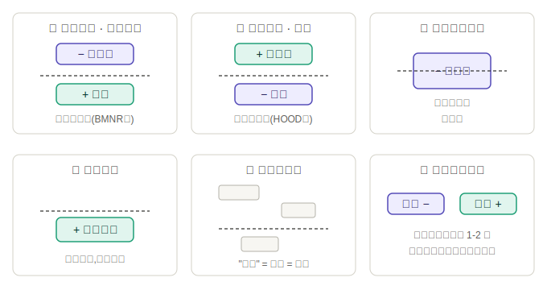

# Dealer Heatmap 五层方法论

## 框架总览



```
第一层 · 原理引擎   对冲是数学强制，不是心理
第二层 · 时间结构   到期组决定力量权重
第三层 · 六步读图   现价 → King → 边界
第四层 · 双重验证   横向共振 · 纵向追踪
第五层 · 分类与执行 结构定剧本，原则定动作
─────────────────────────────────────
边界（横贯所有层）：不预测方向 · 只是估算 · 挡不住事件
```

- 原理层是地基：每一层的"为什么"都能回溯到"dealer 对冲方向由 Gamma 符号唯一决定"这一句，遇到拿不准的判断挖到这层自己推。
- 边界不是最后一课，是横贯线：对每一层的输出都有否决权——结构读得全对，也可能被事件碾过。

---

## 第一层 · 原理引擎

**1. 商业模式决定必须对冲**：dealer 赚价差和时间价值不赌方向，风控对 Delta 敞口有硬性限额——对冲的触发器是一个数字，不是一个判断。

**2. "数学强制"的确切含义**：Delta 是现价的函数，变化率就是 Gamma。

> 例：卖出 100 张 call，Delta 0.50 → 空 5000 股等效 → 买 5000 股对冲。价格涨、Delta 变 0.60 → 必须再买 1000 股；价格跌回 0.45 → 必须卖 1500 股。每一步数量都是公式输出，零主观。
> **推论**：只要合约今天有 Gamma，dealer 今天就在对冲——"哪天到期"决定的是结算日，不是力量生效日。明天到期的合约，今天就在产生真实对冲流。

**3. 符号来源**：客户净买期权 → dealer 净卖 → 负 Gamma；客户净卖（covered call/卖put）→ dealer 净买 → 正 Gamma。每格数字 = 该 strike×到期上 dealer 净 Gamma 的美元估算。



**4. 符号决定行为**：
- 正 Gamma = 弹簧：涨了就卖、跌了就买 → 波动被吸收 → 磁铁/减速带/钉住
- 负 Gamma = 雪球：涨了还买、跌了还卖 → 波动被放大 → 挤压/瀑布/**先过冲再反应**

**5. 这层是全体系裁决依据**：第三层的节点行为、第四层的共振逻辑、第五层的仓位规则，全部由此推出。同时推出硬边界：heatmap 只回答"到了节点会怎样"，永远回答不了"会不会到"。

### 案例一 BMNR（命中，负天花板挤压）
- **盘前结构**（07-09 收盘 checkpoint）：现价 14.78，07-09 收盘价 14.69。15.00 = 负 King -$349K，距现价仅 +1.5%；14.00 正值托底。
- **怎么读**：脚下有地板不好跌；头顶负值不是压力是触发器，一旦突破 dealer 追买。
- **次日走势**（07-10）：跳空高开 15.34（+4.4%），冲到 15.54 穿过 15.00，近端到期 15 Call 当天翻倍（BMNR 无每日到期，非真 0DTE）；尾盘收 14.98 钉回节点——"过冲再反应"前后两半都兑现。



### 案例二 SPCX（落空，工具边界）
- **盘前结构**（07-09）：现价 148.90，收盘价 152.16。150-165 一整片负值区（-$300万~-$407万），170 才有正值。读法：向上一旦启动很顺，发帖人"maybe aim 170"。
- **次日走势**（07-10）：低开 149.62（-1.7%），全天未再触及 150，收 145.42（-4.4%）。发帖人自己复盘"今天跌了也有新闻的因素在了"。
- **教训**：结构没读错，是剧本没被启用——方向初始推力来自机制外的新闻。



### 案例三 RKLB（避坑，假地板）→ 详见第四层

---

## 第二层 · 时间结构

**底层规律（永远成立）**：Gamma 约与 √剩余时间 成反比——越近到期越尖锐。近端列是尖峰，远端列是丘陵。



**官方三档设计**：0DTE（当日）/ 1DTE（下一交易日）/ Weekly（7天内其余）。0DTE/1DTE 共享量能指标（Active Call/Put、Max Change），**Weekly 只有 OI 存量结构，无当日资金流**。

**⚠️ 两条现实约束**：
1. **个股维度**：绝大多数个股（BMNR/RKLB/SPCX 等）只有周度到期，没有每日到期合约。个股图上只有"近端列 vs 远端列"两档，别硬套 0DTE/1DTE 的每日换挡逻辑。
2. **平台现状**：包括 SPX 在内，当前所有到期分组显示的都是"下一个有期权到期日"的 GEX，不存在独立计算的当日 0DTE 切片；0DTE 精细拆分是官方后续迭代项。

**当日力量目前在哪看**：chart 上的 PULSE 黄紫线就是当日活跃对冲力量的实时可视化（黄=正/磁铁边界，紫=负/触发器），配套规则（亮度加权、Fresh/Tested/Spent、紫线 2-4K 证伪）本来就是为"节点会动"设计的。

**将来 0DTE 矩阵上线后的增量**：不是"从无到有看见当日力量"（PULSE 已给），而是**给每根 PULSE 线标出弹药量**——两根同样亮的线信哪根，从经验判断变成读数对比。
- 用法预案：地图用途慢节奏（盘前/10:00/14:00 三个 checkpoint 看结构级结论），信号用途快节奏（只盯已选定节点的数值增减）。执行节奏永远跟 K 线（等触碰、等反应、2-4K 证伪），不跟数据刷新。跳得快伤害拿它当导航的人，不伤害拿它当地形图的人。

---

## 第三层 · 六步读图法（RKLB 近端列实例，现价 81.79）

| 步骤 | 问题 | RKLB 答案 |
|---|---|---|
| ① 定位现价行 | 我站在哪 | 81.79（81.50-82.00 之间） |
| ② 找 King | 谁是老大（全图绝对值最大格） | 80.00 +$622K，现价下方、正值 → 图的性格偏"下有承接" |
| ③ 定地板 | 下方最强节点 | 与 King 重合（80.00）——集中但无第二道防线 |
| ④ 定天花板 | 上方最强节点 | 90.00 +$283K，量级只有地板一半 → 上下引力不对称 |
| ⑤ 扫真空区 | 哪里没人接手 | 80→75 之间格子近零：地板一破即真空加速，再撞 75.00 -$384K 负值格 → 塌落剧本完整路径 |
| ⑥ 找守门员 | 半路谁挡道 | 85.00 +$157K：目标 90 修正为"第一目标 85，过了再看" |



**两条读数原则**：
1. 颜色只用来找两端极值（色阶按当前帧重新拉伸，跨图跨时刻不可比），判断一律看悬停数字。
2. 读完六步必须能输出一句人话："现价 81.79，下方 80 全图最强正地板，上方 85 守门 90 天花板，偏黏；唯一危险剧本是跌破 80 后真空+负值无预兆快跌。"说不出来 = 无序结构 = 不做。

**术语提醒**："近端列" = 该标的下一个有期权到期日那列，不叫 0DTE（见第二层）。

---

## 第四层 · 双重验证

单张快照的两个盲区，对应两个验证方向：



### 横向共振（跨到期列）——防"本周钉位冒充长期的墙"
沿同一行权价行扫过所有到期列。**同号 = 多路对冲流同一价位同方向发力，可信；打架 = 只有一路孤军，孤证只值一天。**

> **案例三 RKLB（完整版）**：07-09 收盘结构，现价 81.79，收盘价 82.55。近端列 80.00 = +$622K King，单看无懈可击；横向扫其余 6 列**全是负值**。→ 判定假地板，"跌破别接"。
> 实际走势：07-10 低开 81.39（-1.4%），盘中插针 79.06 后拉回收 81.05——近端那列当天确实干了活（"假地板不是不干活，是只干一天的活"）；近端列到期滚掉后，该价位露出负值本性，一周内 80 → 76 → 67.35（07-16）。



### 纵向追踪（跨时间）——防"快照上活人死人长一样"
同一格隔几十分钟/隔天再看：**长大 = 有人补弹药；萎缩 = 正在被消耗**。配合触碰次数读："守住两次但数值 620K→410K→180K（示意数字）"不是支撑强，是支撑正在死，第三次测试大概率是终点。与 PULSE 的"Spent 状态、第 3 次后大概率破"同源。

### 验证后节点三级
```
双证通过（横向同号 + 数值稳定/增长）→ 可执行参照，可隔夜
单列成立（横向打架但近端很强）    → 只做当日，到期即作废，别隔夜
两证都不过（打架 + 萎缩）        → 降级观察位，只标记不交易
```

### 两条实操注意
1. **洗牌日（OPEX/四巫）纵向追踪暂停**——节点跳动是换仓噪音，只抓结构不抓数字。
2. **横向扫到 Weekly 列注意口径**——OI 存量 vs 当日量能：同号是"存量共识"，打架可能只是"旧仓 vs 新钱"的时间差；符号可比，量级别直接比。

---

## 第五层 · 分类与执行

### 两套分类语言的关系
- **8 形态库**（悬崖/跳板/变脸-塌落/变脸-弹射/减速带/震荡/无序⭐/趋势阶梯）：节点排布的物理不对称性，细粒度
- **6 实证原型**（16 标的扫描提炼）：实盘高频出现的组合，粗粒度
- 用法：先套原型（快），套不上回形态库细看（慢）

### 六个实证原型
| 原型 | 形状 | 剧本 | 实证 |
|---|---|---|---|
| ① 上负下正 | 头顶负触发器+脚下正托底 | 挤压待发，突破即加速 | BMNR/CRCL/META/IBIT 一周四中四 |
| ② 上正下负 | ①的镜像 | 跌破即加速下杀，下方风险不对称 | HOOD/PLTR |
| ③ 坐在极端负值格 | 现价压在最大负值上 | 两边都不稳，别选边 | — |
| ④ 干净钉位 | 现价紧贴孤立正值大格 | 窄幅震荡，等催化剂 | — |
| ⑤ 混乱量级小 | 无节点统治全场 | **"读不出来"就是结论：不做** | RKLB 07-09（"一般"） |
| ⑥ 跨日结构反转 | 昨日与今日符号翻转 | 近端结构保质期 1-2 天，旧结论作废是常态 | RKLB 两日对比 |



### 执行六原则
1. **图表优先**——K线独立判断在先，heatmap 只做确认；打架时信图表（RKLB：地板守住≠两周-17%趋势反转）
2. **只在极端节点附近动**——无人区没有结构参照，不做
3. **等触碰+反应，永不预判**——正节点看减速，负节点容忍先过冲；同 PULSE 紫线 2-4K 证伪窗口
4. **止损节点外侧，目标下一节点**——结构给天然失效位；单列孤证节点（如 RKLB 80）损更紧或不做
5. **环境定仓位**——正值主导正常仓；负值主导砍半、不接飞刀
6. **洗牌期暂停**——OPEX/四巫/数据日不做新决策，纪律替失真的工具值班

### 完整决策链示范（BMNR）
```
第一层  15.00 负值 → 雪球机制 → 突破后 dealer 追买
第二层  King 在近端列，力量今天生效但寿命短
第三层  现价 14.78 → King 15.00(-349K) → 地板 14.00
第四层  只有近端列时横向验证缺失，是已知隐患
第五层  原型① → 剧本"突破15加速" → 次日跳空即反应确认 → 目标下一节点，不贪
边界    全程自问：今天有没有事件？（SPCX 死在这一问没问）
```

---

## 全框架一句话收束

**原理层告诉你力量从哪来（公式不是观点），时间层告诉你力量什么时候多大（越近到期越尖、但平台还没拆出当日切片），读图层告诉你力量在哪（六步→一句人话），验证层告诉你哪些力量是真的（横向共振+纵向弹药），执行层告诉你怎么把真力量变成仓位（原型定剧本、六原则扣扳机）——而边界永远在旁边提醒：这一切只回答"到了会怎样"，从不回答"会不会去"。**
