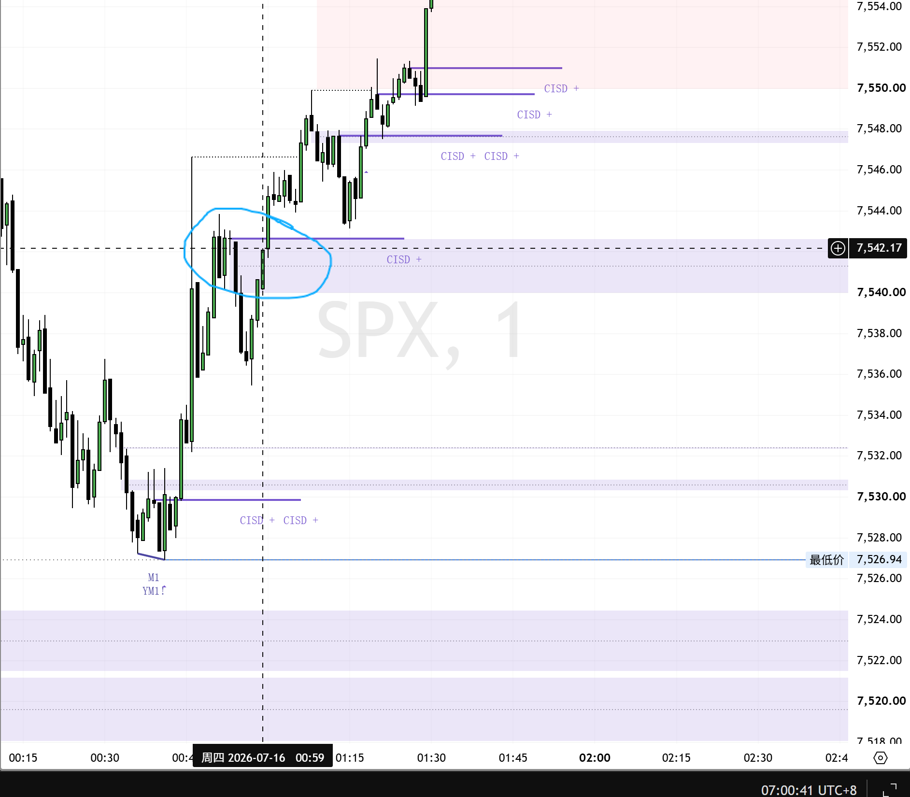
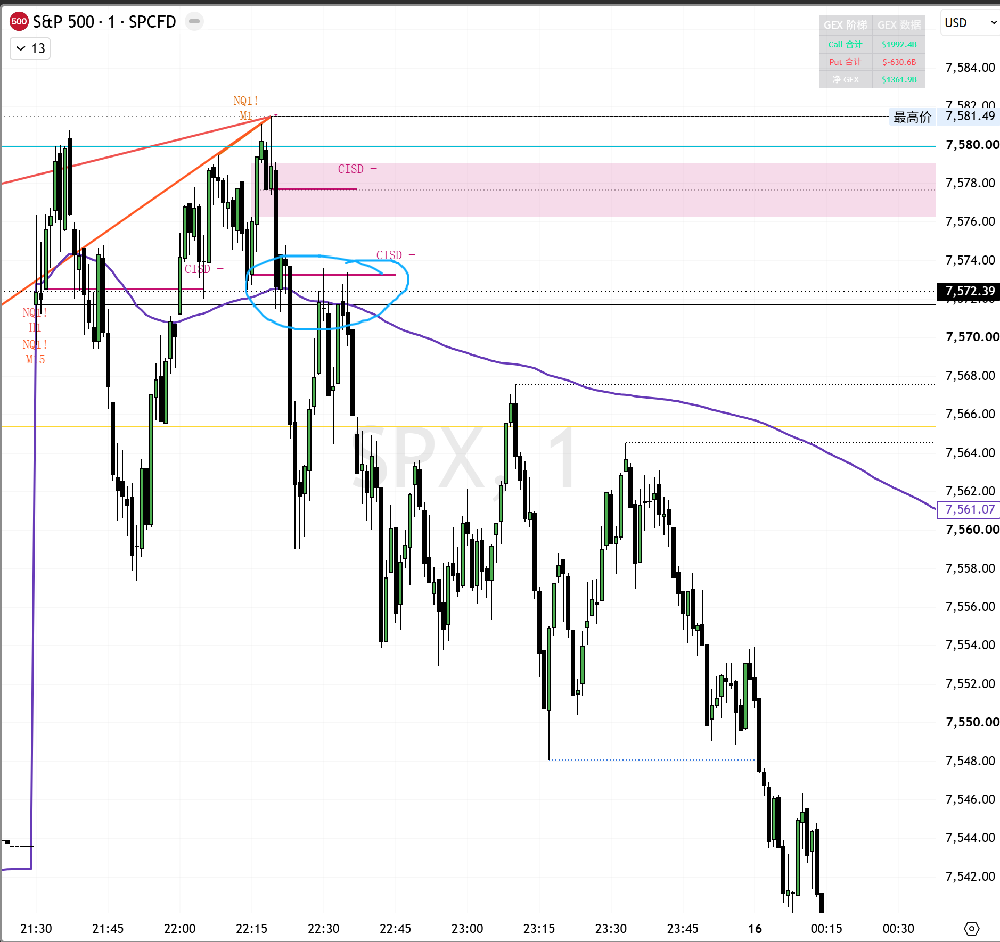

# 第三章：突破回踩与失败突破

> 突破本身只是市场提出方向，回踩结果才决定这个方向是否被接受。

## 一、突破后只有两条路径

价格离开一个关键区间后，最终只需要判断两件事：

~~~text
回踩仍留在新区间外 → 突破被接受，寻找顺势机会
快速回到原区间 → 突破被否定，寻找失败方向
~~~

因此，顺势突破和失败突破并不是两套互不相关的策略。它们来自同一个问题：

> 价格最终被市场接受在关键位的哪一侧？

## 二、什么才算有效突破

高质量突破通常具备以下条件：

1. 突破发生在事先标记的关键位置，而不是随机发生在区间中间。
2. 突破 K 线有清晰实体，收盘位于关键位外侧。
3. 价格离开原区间后没有立即被完全收回。
4. 回踩时卖方或买方无法把价格压回旧区间。
5. 回踩后重新出现顺势推进。

只有一根大 K 线并不足以证明突破有效。大 K 线也可能来自止损触发、新闻波动或短暂流动性真空。

建议把有效突破拆成三个阶段：

~~~text
位移：价格明确离开旧区间
测试：价格回到突破位附近
接受：回踩守住，并重新顺势推进
~~~

## 三、标准顺势回踩

### 多头流程

~~~text
价格突破阻力
→ 实体收在阻力上方
→ 等待回踩
→ 回踩没有重新跌入旧区间
→ 重新向上启动
→ 建立多头仓位
~~~

失效条件：

- 实体重新收回旧区间
- 回踩低点被有效跌破
- 价格重新站到 VWAP 下方且反弹不能收回
- 入场后连续数根 K 线仍无法离开突破位

第一目标通常是上方下一个节点、前高或流动性区域。

### 空头流程

~~~text
价格跌破支撑
→ 实体收在支撑下方
→ 等待反抽
→ 反抽无法站回旧区间
→ 重新向下启动
→ 建立空头仓位
~~~

失效条件：

- 实体重新站回旧区间
- 反抽高点被有效突破
- 价格收回 VWAP 并完成回踩
- 入场后没有出现预期的向下位移

第一目标通常是下方前低、下一节点或缺口边缘。

## 四、回踩确认不是“碰线”

价格触碰突破位，只代表测试开始，不代表测试成功。

回踩是否成立，需要观察：

- 回踩 K 线收在哪里
- 是否重新进入旧区间
- 是否出现连续承接或拒绝
- 下一根 K 线能否顺原方向推进
- VWAP 和大级别结构是否支持

在 1 分钟图上，可以把默认确认单位设为连续 2—3 根 K 线：

~~~text
第一根：回到关键位
第二根：测试能否收回旧区间
第三根：确认继续推进还是失败
~~~

强趋势中可能只给一次很浅的回踩，但这不意味着可以在距离关键位很远的位置追单。错过第一次合理回踩，应等待下一次结构机会。

## 五、图例一：收回关键区后的多头确认

*图 1：价格收回关键区域，回踩没有重新跌回弱势区间，随后继续创造更高的高点。图中价格仅用于历史复盘。*

蓝圈附近可以拆解为：

~~~text
位置：前期结构区
位移：价格向上收回关键位
测试：短暂回踩关键区域
接受：回踩守住并重新向上
失效：再次跌回收回区域
目标：上方下一结构区
~~~

第一次向上收回只是候选信号。真正提高胜率的，是回踩后价格仍愿意停留在新区间，并再次向上推进。

## 六、什么是失败突破

失败突破是指价格短暂离开关键区间，但没有在新区间获得持续接受，随后快速回到原区间。

常见结构：

~~~text
突破区间
→ 缺乏持续跟随
→ 快速收回原区间
→ 回测突破位
→ 无法重新突破
→ 向反方向扩张
~~~

失败突破的重点不是“突破后马上反手”，而是等待两个确认：

1. 价格已经明确回到原区间。
2. 再次测试突破位时无法重新站回。

如果价格只是短暂回到边界附近，却很快重新站回新区间，原突破仍然可能有效。

## 七、失败突破的标准执行

### 向上假突破后的空头

~~~text
突破上沿
→ 快速跌回区间
→ 反抽上沿失败
→ 跌破反抽结构低点
→ 建立空头仓位
~~~

失效点放在失败突破高点外，或者价格重新站上区间上沿并回踩守住的位置。

目标依次考虑：

1. 区间中轴
2. 区间下沿
3. 下一个结构节点

### 向下假突破后的多头

~~~text
跌破下沿
→ 快速收回区间
→ 回踩下沿守住
→ 突破回踩结构高点
→ 建立多头仓位
~~~

失效点放在失败突破低点外，或者价格重新跌破区间下沿并反抽失败的位置。

目标依次考虑：

1. 区间中轴
2. 区间上沿
3. 上一个结构节点

## 八、图例二：冲高失败后的空头确认

*图 2：价格冲高后快速回落，反抽无法重新站回关键区和 VWAP，随后形成更低的高点与更低的低点。图中价格仅用于历史复盘。*

图中的空头逻辑不是看到第一根下跌 K 线就追空，而是：

~~~text
位置：前高和上方阻力区
失败：冲高后快速收回
测试：反抽关键区和 VWAP
确认：反抽站不上，结构继续向下
失效：重新站回关键区并回踩守住
目标：下方前低和下一结构节点
~~~

## 九、海龟汤：失败突破的一种结构

所谓“海龟汤”，可以简单理解为：

> 价格突破一个明显区间，吸引追单并触发止损，随后迅速回到区间内，向反方向运行。

它仍然必须遵守普通失败突破的规则：

~~~text
先有清晰区间
→ 出现突破
→ 突破快速收回
→ 等待回测
→ 回测无法恢复突破
→ 顺失败方向入场
~~~

不能仅凭长影线、十字星或单根反转 K 线认定海龟汤。形态必须发生在重要边界，并得到后续收线与回测确认。

## 十、统一决策树

~~~mermaid
flowchart TD
    A["价格到达关键位"] --> B{"是否实体突破/跌破?"}
    B -- "否" --> N["不交易，继续等待"]
    B -- "是" --> C["不追第一根，等待回踩"]
    C --> D{"回踩是否留在新区间?"}
    D -- "是" --> E["突破被接受"]
    E --> F["再次启动时顺势建仓"]
    D -- "否" --> G{"是否快速回到原区间?"}
    G -- "否" --> N
    G -- "是" --> H["突破被否定"]
    H --> I{"再次测试能否恢复突破?"}
    I -- "能" --> C
    I -- "不能" --> J["顺失败方向建仓"]
~~~

## 十一、仓位与止损

突破交易的仓位不能由“突破力度看起来很强”决定，而应由止损距离和最大允许亏损决定。

~~~text
计划风险金额 = 账户资金 × 单笔风险比例
允许仓位 = 计划风险金额 ÷ 每单位止损风险
~~~

止损优先使用结构位置：

- 顺势多头：回踩低点或旧区间内
- 顺势空头：反抽高点或旧区间内
- 失败突破空头：假突破高点外
- 失败突破多头：假突破低点外

固定点数只能作为风险上限，不能替代结构失效。

时间也属于止损。如果入场后 2—4 根执行周期 K 线仍无法离开关键位，应当减仓或退出。

## 十二、不做条件

以下情况不适合执行突破策略：

- 价格位于两个关键位置中间
- 突破只有影线，没有实体收盘确认
- 突破后没有回踩，价格已经远离关键位
- 回踩过程中反复穿越 VWAP
- 主要指数明显不同步
- 距离下一目标太近，风险收益不足
- 即将公布重大数据
- 无法写出清晰的失效点

## 十三、第三章执行卡

~~~text
关键位置：
原区间：
突破方向：
是否实体收在区间外：
是否完成回踩：
回踩最终接受在哪一侧：
入场触发：
结构失效点：
第一目标：
计划风险：
入场后最多等待几根 K：
~~~

## 本章总结

突破交易的核心不是追逐速度，而是等待市场证明它愿意在新区间成交。

~~~text
突破后回踩守住 → 顺势
突破后快速收回 → 降级
收回后再次测试失败 → 反向
没有确认 → 不做
~~~

最值得反复练习的一句话是：

> 穿过以后等回踩；回踩站稳做延续，站不稳做失败。
