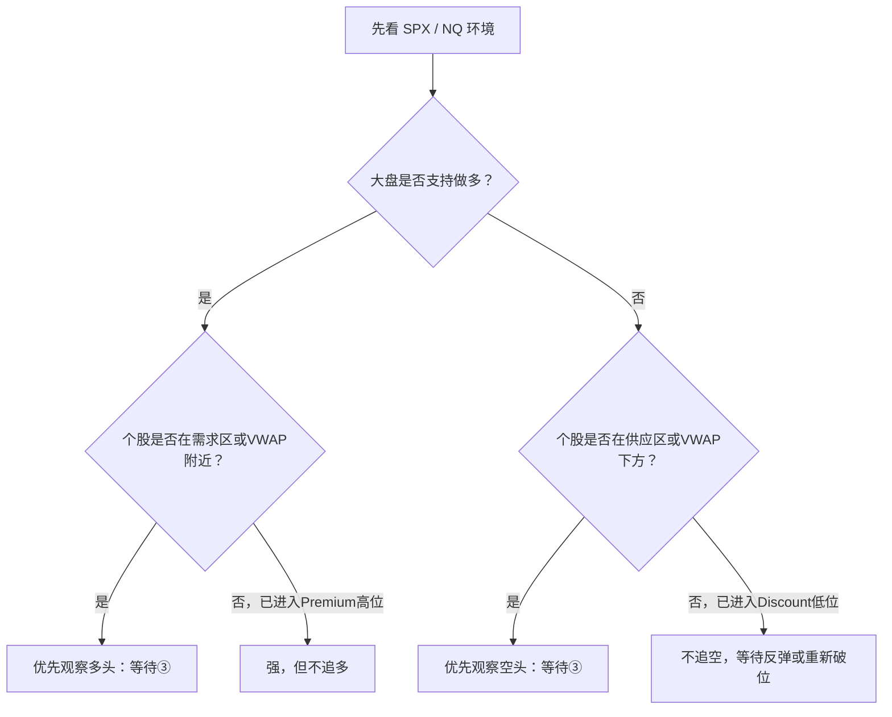

# 第七章：相对强弱与高位末端冲刺

> 强势股不一定适合立即买入；真正有价值的是“强势仍然处于可控风险的位置”。

## 一、相对强弱到底是什么

相对强弱不是简单比较谁涨得多，而是观察个股相对于 SPX、NQ 或所属板块的行为：

```text
大盘回调时，个股抗跌；
大盘重新转强时，个股领涨；
回踩时仍然守住需求区、VWAP或前一个更高低点。
```

因此，真正的相对强势至少包含两段证据：

```text
抗跌 → 领涨
```

只有单独一段快速上涨，不能直接定义为高质量相对强势。

## 二、四种常见状态



### 1. 大盘支持，个股在需求区

这是最理想的多头筛选环境：

```text
SPX/NQ在VWAP上方
→ 个股回踩需求区
→ 个股不破结构低点
→ 收回VWAP或关键线
→ ③再次启动
```

这里的③仍然是：回踩守住后，价格重新突破回踩结构的小高点。它不是第三根K线，也不是指标箭头。

### 2. 大盘支持，个股已经在高位供应区

例如个股快速拉升到 Premium、Supply、Strong High 或 Weak High 附近。此时标的可能仍然很强，但入场位置已经变差：

- 离 VWAP 太远；
- 结构止损距离变大；
- 距离上方目标变近；
- 容易出现冲高回落。

正确处理是等待：

```text
突破前高并回踩守住
```

或者：

```text
回落到VWAP/需求区
→ 守住
→ ③再次启动
```

强势不等于现在可以买。

### 3. 大盘偏弱，个股在高位供应区

这是空头观察条件较好的组合：

```text
SPX/NQ跌破VWAP
→ 个股在Premium或Supply受阻
→ 形成更低高点
→ 跌破回踩低点
→ ③向下启动
```

不能因为价格进入红色区域就立即做空，必须等拒绝和结构确认。

### 4. 大盘偏弱，个股已经在低位需求区

个股虽然偏弱，但如果已经接近 Demand 或 Discount，继续追空容易卖在支撑上。

更科学的空头条件是：

```text
需求区被跌破
→ 实体收线确认
→ 反抽不过
→ ③向下启动
```

没有破位和反抽失败时，只观察，不追空。

## 三、真正强势与高位末端冲刺

| 类型 | 价格位置 | 回踩质量 | 大盘同步 | 处理 |
| --- | --- | --- | --- | --- |
| 真正相对强势 | 需求区、VWAP或新结构附近 | 缩量且守住 | 同步转强 | 等③做多 |
| 高位末端冲刺 | Premium、Supply或前高附近 | 没有低风险回踩 | 同步减弱或停滞 | 不追，等新结构 |
| 弱势反弹 | 低位需求区上方 | 反弹无法收复压力 | 大盘偏弱 | 不追空，等破位 |
| 中间噪音 | 两个区域之间 | 反复穿越VWAP | 市场分化 | 观望 |

### 高位末端冲刺的常见特征

```text
快速拉升
→ 远离VWAP
→ 进入Premium/供应区
→ 成交量放大但实体变小
→ 上影线增加
→ 大盘不再同步
→ 高位横盘或回落
```

这类行情最容易让人产生“它这么强，不能空，所以只能买”的错觉。实际上，不能做空和不能追多可以同时成立。

## 四、用六宫格筛选个股

复盘六只大型科技股时，可以依次问：

```text
1. SPX/NQ当前支持多头还是空头？
2. 这只股票相对大盘是抗跌、同步还是落后？
3. 价格在Demand、Equilibrium还是Premium？
4. VWAP在价格下方还是上方？
5. 回踩是否缩量并守住结构？
6. 是否已经完成③？
```

刚才的示例可以这样分类：

- TSLA：相对强，但进入高位供应区，属于“强但不追”；
- NVDA：冲高回落后测试支撑，需求区守住后才观察多头；
- AAPL：需求区反弹，但尚未收复上方压力；
- GOOGL：相对偏弱但接近需求区，不宜继续追空；
- META：下跌后反弹到平衡区，方向和位置都不够清楚；
- MSFT：相对稳定，但处于区间中间，仍需等待边界突破。

这些是截图复盘中的历史状态，不是后续交易点位。

## 五、执行规则

```text
大盘方向：能不能做
个股强弱：选谁做
需求/供应区：在哪里做
VWAP：环境是否支持
③：现在能不能执行
```

做多的最小证据链：

```text
大盘同侧
→ 个股在低风险位置
→ 回踩守住
→ 突破回踩结构
→ ③再次启动
```

做空的最小证据链：

```text
大盘同侧
→ 个股在高位供应区或VWAP下方
→ 反抽失败
→ 跌破回踩结构
→ ③向下启动
```

本章最终原则：

> 相对强弱负责筛选标的，需求/供应区负责筛选位置，③负责触发建仓。
