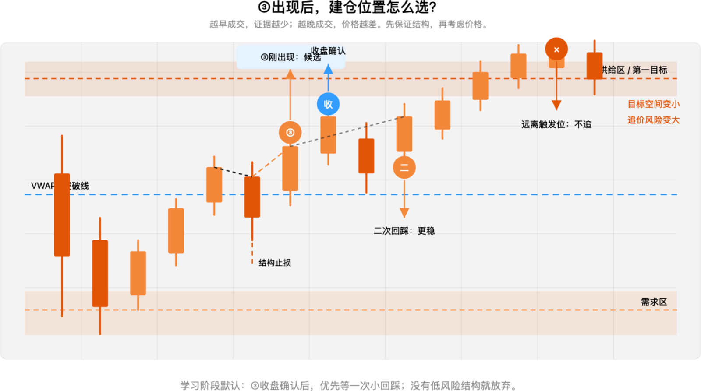

# 第九章：③后的建仓时机与追价控制

> ③是第一个可执行确认，但不是看到③就必须重仓追入。

前面已经确认：

```text
① 突破关键位
② 回踩守住
③ 突破回踩结构
```

本章进一步回答：③出现后，应该立即建仓、等待收盘，还是等待二次回踩？

## 一、③出现后有四种状态



*图 1：同一段上涨结构中，③刚出现、③收盘确认、③后的二次回踩，以及已经远离触发位的追价位置。图中价格为构造示例。*

### 1. ③刚出现：早，但证据较少

价格刚突破回踩高点时，方向已经得到初步确认，但仍可能出现：

- 影线假突破；
- 突破后立即回到旧区间；
- 上方供给区距离过近；
- 目标空间不足。

如果使用这种方式，只能考虑小仓试探，并且必须提前定义结构止损。学习阶段不把它作为默认入场点。

### 2. ③收盘确认：默认方式

```text
③突破
→ 等待1分钟K收盘
→ 实体仍在触发位外侧
→ 检查目标空间与结构止损
→ 建仓
```

收盘确认可以过滤许多“盘中刺穿、收盘跌回”的假突破。代价是入场价格可能更高，甚至可能错过行情，但这是用成交价格换取结构证据。

### 3. ③后的二次回踩：更保守

```text
③突破并收盘
→ 小幅回踩触发位或③附近
→ 回踩没有重新跌回旧区间
→ 再建立主要仓位
```

这种方式的价格可能不如第一次突破便宜，但通常拥有更清楚的失效点，适合学习阶段和波动较大的 0DTE 环境。

### 4. 已经远离③：不追价

如果价格已经：

- 接近上方供给区或第一目标；
- 明显远离 VWAP 和触发位；
- 结构止损距离变大；
- 剩余收益不足以覆盖风险；

即使方向判断正确，也不应再追入。等待新的高低点结构或下一次回踩。

## 二、如何选择入场方式

| 状态 | 证据 | 风险 | 学习阶段处理 |
| --- | --- | --- | --- |
| ③刚出现 | 初步确认 | 假突破风险较高 | 小仓或等待 |
| ③收盘确认 | 结构和收线同时支持 | 价格略差 | 默认方式 |
| 二次回踩 | 两次测试均守住 | 可能错过 | 保守优先 |
| 远离触发位 | 方向可能仍对 | 盈亏比变差 | 放弃追价 |

默认优先级：

```text
③收盘确认 + 二次回踩
> ③收盘确认
> ③刚出现小仓试探
> 远离③后追价
```

## 三、用盈亏比决定是否值得建仓

③出现并不等于这笔交易值得做。还要计算：

```text
风险 = 入场价格 − 结构止损
潜在收益 = 第一目标 − 入场价格
```

例如：

```text
关键位：7500
③突破：7504
二次回踩：7502—7503，仍然守住
结构止损：7500下方
第一目标：7515附近
```

如果价格在二次回踩后仍有足够目标空间，可以继续评估；如果已经冲到 `7513` 附近，再追入时剩余收益很小，即使方向正确，也可能不值得承担结构风险。

不要把“至少多少点”当成固定规则，因为 SPX 的波动会随时段和环境变化。应该根据当前结构止损距离和下一个供给/阻力位置计算。

## 四、5分钟与1分钟怎样配合

```text
5分钟：确认环境和关键位
1分钟：确认③、收盘和二次回踩
```

如果 1 分钟已经出现③，但 5 分钟仍然：

- 处于明显下降结构；
- 位于 VWAP 下方；
- 接近供给区；
- 距离下一目标太近；

则信号应降级。不能让一根 1 分钟漂亮 K 线推翻整个 5 分钟环境。

## 五、入场后的时间确认

建仓后，如果连续 2—4 根 1 分钟 K 线仍然无法离开触发位，说明市场没有按照预期产生位移。

此时可以：

- 减仓；
- 把观察仓退出；
- 或在价格重新收回旧区间时直接退出。

时间止损不是因为“持仓时间到了”就机械卖出，而是因为价格在应该推进的地方没有推进。

## 六、本章执行卡

```text
③是否已经出现：
③是否收盘确认：
是否等待二次回踩：
入场价格：
结构止损：
第一目标：
剩余空间是否足够：
5分钟环境是否支持：
入场后2—4根1分钟K是否产生位移：
```

## 本章总结

```text
③刚出现：方向初步确认
③收盘确认：过滤假突破
二次回踩：提高结构质量
远离③追价：盈亏比恶化
```

最重要的一句话：

> 先保证结构和风险可定义，再考虑成交价格；错过一笔交易，比在目标空间不足时追价更安全。

> 本章用于交易教育和个人研究，不构成投资建议。图例为构造示例，不能直接视为实时买卖信号。
